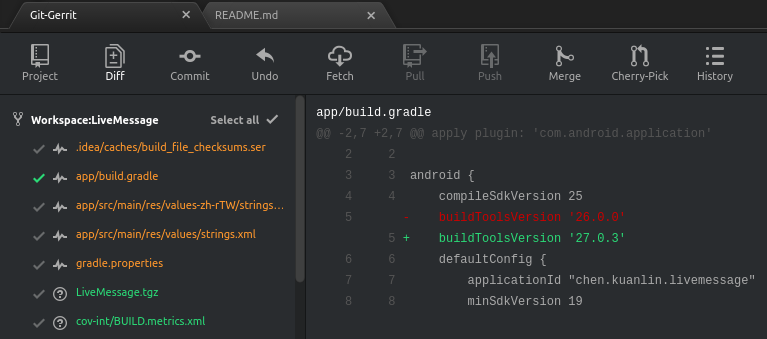

# Atom git-gerrit

# Overview

Provides a GUI interface to manage commonly-used git commands. This project is forked from git-control published by jacogr, and integrate git commands with gerrit code review.

This package can be found on the Atom registry [git-gerrit](https://atom.io/packages/git-gerrit).

# Screen

